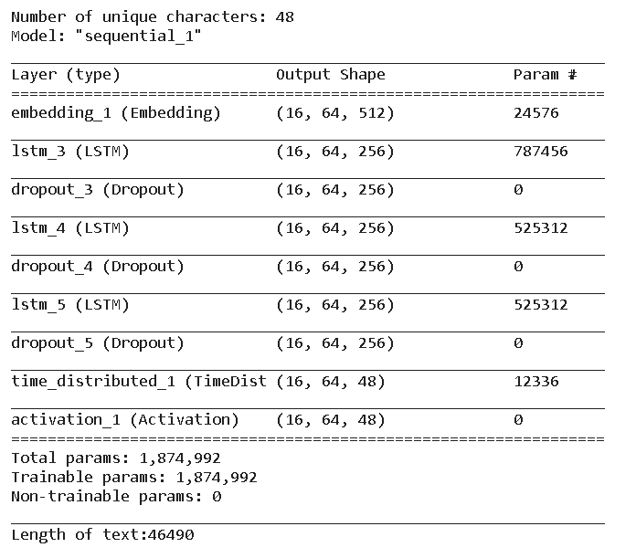

# SequencePredictionRNN

This code implements a multi-layer character-level RNN using LSTM's. It takes in a sequence of characters, trains on it and learns predict new characters in the sequence.

# Data

The underlying dataset includes one of the stories of Sherlock Holmes  (A Scandal in Bohemia), the text file can be found in the data folder. In order to train the model on a new sequence, you can add your own input data inside the data folder. 

# Training

Staetful RNN's are used, batches are created in such a way such that batches have in sequence in continuous of the previous batches so that output of a batch can be fed as an input to the next batch. Stateful RNN's are useful when training on one big sequences.

train.py can be used to train the model the underling dataset

# Model Architecture

model.py contains the model architecture, the current model contains an embedding layer followed by 3 LSTM layers with 256 units and eventually a TimeDistributedDense Layer

# Sampler

Once the model is trained sample.py file could be used to generate a new sequence based on the header/starter provied

# Results

Below is a sample result.

``python sample.py 100 --seed he said to me ``

he said to me”  “quite so,” he answered, lighting a cigarette, and throwing himself down into an armchair. “you see, but you do not observe. the distinction is clear. for example, you have frequently seen the steps which lead up from the hall to this room.”  “frequently.”  “hur arre there in an instant, and i caught a glimpse of it as she half drew it out. when i cried out that it was a false alarm, she replaced it, glanced at the rocket, rushed from the room, and i have not seen her since. i rose, and, making

Here some observations

* model was able to generate a reply within proper double quotes after the seed text he said to me.
* Since the training dataset was small so the model had faced some overfitting, hence causing some sentences are picked as it is from the original text, however the interesting thing was how the model was able to create new paragraph by merging various sentences

# FUTURE WORK AN REFERENCES

* Currently the model is not able to generate new sentences well, increase the training set size to enable the model to learn better (current file is <1 MB)
* Once training set size is significant, slighlty complex model architecures could be tried.
* A special mention the [this](http://karpathy.github.io/2015/05/21/rnn-effectiveness/) excellent Andrej Karpathy blog which gives an intuitive understanding of sequence generation problem.

